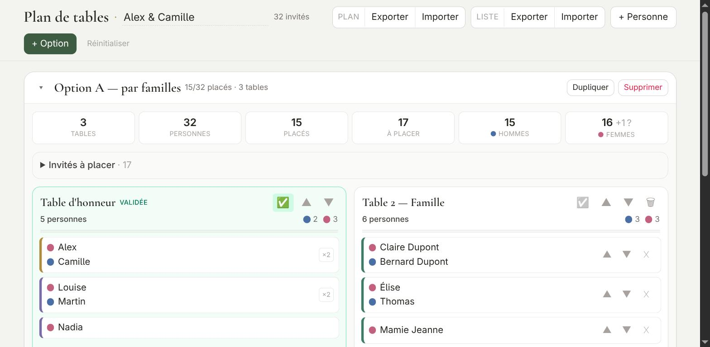

# Plan de tables

Un outil simple pour composer le plan de table d'un mariage — ou de n'importe quel banquet, séminaire ou repas de famille.

Un seul fichier HTML. Pas de compte, pas de serveur, pas de base de données : tout se passe dans votre navigateur et rien ne quitte votre machine.

👉 **[Ouvrir l'application](https://dsebastien.github.io/plan-de-tables-mariage/)** *(si GitHub Pages est activé — sinon voir « Utilisation » ci-dessous)*



---

## Pourquoi

Faire un plan de table, c'est essayer une disposition, se rendre compte que ça ne va pas, tout recommencer, puis vouloir comparer avec la version d'avant. Les tableurs s'y prêtent mal : on perd les couples, on recompte les places à la main, et on n'a jamais deux versions côte à côte.

Cet outil part de trois constats :

- **Les couples se déplacent ensemble.** Un couple est une *unité* : on le glisse d'un bloc. On le compose ou on le défait quand on veut, en glissant les personnes.
- **On veut plusieurs propositions en parallèle.** Chaque « option » est un plan complet et indépendant, partageant la même liste d'invités. On les duplique, on les compare, on jette.
- **Certaines tables sont acquises.** Une table validée se verrouille : plus de déplacement accidentel pendant qu'on remue le reste.

## Fonctionnalités

| | |
|---|---|
| **Options multiples** | Autant de dispositions que voulu sur la même liste d'invités. Duplication en un clic pour partir d'une variante. |
| **Couples** | Deux personnes forment une unité qui se déplace toujours ensemble (badge `×2`). Se compose et se défait par glisser-déposer, à tout moment. |
| **Groupes colorés** | Famille, amis, collègues… chaque groupe a sa couleur, visible d'un coup d'œil sur chaque étiquette. |
| **Glisser-déposer** | À la souris sur ordinateur : entre tables, pour réordonner à l'intérieur d'une table, et pour former ou défaire un couple. Un repère montre ce qui va se passer avant de lâcher. Sur mobile/tablette, on touche un invité puis la table de destination. |
| **Renommage des personnes** | Bouton ✎ (ou double-clic sur le nom) à tout moment, y compris pour quelqu'un déjà placé : le placement est conservé dans toutes les options. |
| **Tables verrouillables** | Une table « validée » passe en lecture seule et en vert. |
| **Compteurs en direct** | Par table : nombre de personnes et répartition hommes/femmes. Globalement : placés / à placer. |
| **Genre modifiable** | Clic sur la pastille de couleur, ou clic droit sur la ligne de la personne : Homme → Femme → `?`. |
| **Sauvegarde automatique** | L'état est conservé dans le navigateur (`localStorage`) : fermez l'onglet, retrouvez votre travail. |
| **Import / export JSON** | Deux formats distincts (voir plus bas) pour sauvegarder, partager, ou éditer la liste à la main. |
| **Export Markdown** | Le plan complet, la liste des invités, ou une table isolée — en texte lisible, à imprimer, coller dans un document ou envoyer au traiteur. |
| **Hors-ligne après chargement** | Une fois la page chargée, aucune requête réseau n'est faite. |

## Utilisation

### Le plus simple

Ouvrez **[la démo en ligne](https://dsebastien.github.io/plan-de-tables-mariage/)**.

### En local

```bash
git clone https://github.com/dsebastien/plan-de-tables-mariage.git
cd plan-de-tables-mariage
xdg-open index.html   # ou : open index.html (macOS), start index.html (Windows)
```

Aucune installation, aucune dépendance à télécharger, aucun serveur à lancer. Vous pouvez aussi simplement télécharger `index.html` et double-cliquer dessus.

> **Note** — Tailwind CSS et la police Cormorant Garamond sont chargés depuis un CDN. Une connexion est donc nécessaire au **premier** chargement ; la mise en page est dégradée si vous ouvrez le fichier totalement hors-ligne. Voir [Utilisation hors-ligne](#utilisation-hors-ligne).

### Premiers pas

L'application démarre **vide**, avec une première option prête à l'emploi.

1. **Constituez la liste.** Bouton **+ Personne** : un nom, un genre, un groupe. Le champ *Partenaire* (optionnel) crée directement un couple. Le formulaire reste ouvert pour enchaîner les ajouts et retient le dernier groupe utilisé.
   Pour une longue liste, il est plus rapide d'écrire un fichier JSON et de l'importer — voir [`examples/liste-invites-exemple.json`](examples/liste-invites-exemple.json).
2. **Créez des tables.** Bouton **+ Ajouter une table** dans l'option.
3. **Placez les invités.** Glissez-les depuis « Invités à placer », ou touchez un invité puis la table (pratique sur mobile).
4. **Comparez.** Bouton **+ Option** pour une seconde disposition, ou **Dupliquer** pour partir de l'existante.
5. **Sauvegardez.** Le navigateur retient tout automatiquement, mais exportez le JSON avant les grosses manœuvres : c'est votre filet de sécurité.
6. **Partagez.** Quand le plan est arrêté, **Plan › Markdown** (ou **⬇** sur une table) produit un fichier texte à imprimer, à coller dans un document ou à envoyer au traiteur.

### Raccourcis et gestes

- **Clic sur une pastille de couleur**, ou **clic droit sur la ligne d'une personne** → fait défiler son genre (H → F → `?`).
- **Clic sur un nom de table ou d'option** → renommage sur place (`Entrée` valide, `Échap` annule).
- **✎ à côté d'un nom, ou double-clic sur ce nom** → renommage de la personne, même si elle est déjà assignée à une table (les placements suivent). Un nom déjà utilisé est refusé, pour garder l'import/export cohérent.
- **Clic sur l'en-tête d'une option** → replie / déplie.
- **✅ sur une table** → verrouille (validée) / déverrouille.
- **⬇ sur une table** → exporte cette table seule en Markdown.
- **✕ sur une étiquette dans « Invités à placer »** → supprime la personne de la liste, partout.
- **Nom de l'événement** (en-tête) → sert à nommer les fichiers exportés.

### Glisser-déposer : trois gestes sur la même étiquette

Sur ordinateur, ce qu'on obtient dépend de l'endroit exact où on lâche. Un repère l'annonce toujours avant :

| Geste | Repère | Effet |
|---|---|---|
| Lâcher sur le **bord haut ou bas** d'une étiquette, dans une table | trait vert au-dessus / en dessous | Réordonne les invités de la table |
| Lâcher au **milieu** d'une étiquette compatible | cadre doré | **Forme un couple** — les deux personnes ne feront plus qu'une unité |
| Tirer la poignée **⠿** d'un membre de couple ailleurs | selon la cible | **Défait le couple** : la personne redevient seule, et atterrit là où on la lâche (table, vivier, ou en couple avec quelqu'un d'autre) |

- Un couple compte deux personnes : le cadre doré n'apparaît que si la fusion donne bien un duo (personne seule + personne seule).
- Le couple formé hérite du **groupe et de la place** de l'étiquette d'accueil.
- Composer ou défaire un couple modifie la **liste**, donc **toutes les options** — pas seulement celle où on manipule. En séparant quelqu'un, la personne garde sa place à table dans chaque option.
- Sans souris : le bouton **⠿** répond aussi au simple clic et sépare la personne sur place. Former un couple demande en revanche un glisser-déposer, ou le champ *Partenaire* du formulaire **+ Personne**.

## Formats de fichiers

Deux formats JSON pour sauvegarder et recharger, un export Markdown pour lire et partager. À l'import, le type est **détecté automatiquement** : peu importe le bouton utilisé.

### Liste d'invités — `liste-invites*.json`

Le format court, pensé pour être écrit et modifié à la main. Chaque groupe contient des *unités* ; une unité est un tableau de `[nom, genre]`, avec un élément (personne seule) ou deux (couple). Le genre vaut `"M"`, `"F"` ou `"?"`.

```json
{
  "type": "liste-invites",
  "groups": [
    {
      "name": "Amis",
      "units": [
        [["Julie", "F"], ["Antoine", "M"]],
        [["Margot", "F"]]
      ]
    }
  ]
}
```

À l'import, la liste **remplace** l'existante. Les placements déjà faits sont conservés par correspondance de noms ; les personnes qui ont disparu de la nouvelle liste sont retirées des tables, avec un avertissement listant lesquelles.

### Plan complet — `plan-de-tables*.json`

L'état intégral : nom de l'événement, liste des personnes, options, tables, placements et verrous. C'est le format de sauvegarde et de partage.

À l'import : si votre liste locale est vide, celle du plan est adoptée telle quelle. Sinon le plan est **fusionné sur la liste courante** par correspondance de noms — ce qui permet de recharger un ancien plan sur une liste retravaillée. Les invités du plan absents de la liste courante sont ignorés, avec un avertissement.

### Markdown — `*.md`

Trois exports, tous en **sens unique** : ils servent à lire, imprimer ou partager, pas à recharger l'application. Pour cela, gardez le JSON.

| Bouton | Fichier | Contenu |
|---|---|---|
| **Plan › Markdown** | `plan-de-tables-<événement>.md` | Toutes les options, leurs tables, la composition de chacune et les invités restant à placer |
| **Liste › Markdown** | `liste-invites-<événement>.md` | Les groupes, leurs unités et le genre de chacun |
| **⬇** sur une table | `table-<nom>-<événement>.md` | Cette table seule : effectif, répartition H/F, et qui y est assis avec son groupe |

Un `.md` est un fichier texte : il se lit tel quel dans n'importe quel éditeur, et se met en forme dans les outils qui comprennent Markdown (Obsidian, GitHub, Notion, VS Code…).

```markdown
# Mariage Claire & David — Option 1

## Table des amis

8 personnes — 4 hommes, 4 femmes

- Julie & Antoine _(couple)_ — Amis
- Margot — Amis
```

> ⚠️ **Les noms servent de clé.** Deux personnes ne peuvent pas porter exactement le même nom : ajoutez une précision (`Marie Dupont`, `Marie (cousine)`). L'application refuse les doublons à la saisie.

## Utilisation hors-ligne

Pour un fichier réellement autonome — utile le jour J, dans une salle sans wifi — remplacez les deux ressources externes de l'en-tête par leur contenu :

1. Téléchargez [Tailwind CSS](https://cdn.tailwindcss.com) et collez-le dans une balise `<script>` en place de `<script src="https://cdn.tailwindcss.com"></script>`.
2. Supprimez la ligne `@import url('https://fonts.googleapis.com/...')` — l'application retombe alors sur Georgia, très proche visuellement.

## Confidentialité

Une liste d'invités, c'est une liste de personnes réelles. Rien n'est envoyé nulle part : pas d'analytics, pas de télémétrie, pas d'appel réseau après le chargement de la page. Les données vivent dans le `localStorage` du navigateur et dans les fichiers (JSON ou Markdown) que vous exportez vous-même. Le bouton **Réinitialiser** efface tout.

## Technique

Un fichier, ~930 lignes, sans étape de build :

- HTML + CSS + JavaScript standard, aucune dépendance à installer
- [Tailwind CSS](https://tailwindcss.com/) via CDN pour la mise en forme
- Rendu par re-génération complète du DOM à chaque action — l'état est un simple objet JavaScript, ce qui garde le code lisible et sans surprise
- Délégation d'événements globale via des attributs `data-act`

La structure de l'état :

```
state
├── title       nom de l'événement
├── groups[]    { id, name, color, units[] }
│   └── units[] { id, members[] }        ← une unité = 1 personne ou 1 couple
│       └── members[] { id, name, g }    ← g: 'M' | 'F' | '?'
└── scenarios[] { id, name, collapsed, tables[] }
    └── tables[] { id, name, locked, units[] }   ← units[] = ids d'unités
```

## Contribuer

Les contributions sont bienvenues — voir [CONTRIBUTING.md](CONTRIBUTING.md).

## Licence

[MIT](LICENSE) © Sebastien Dubois

---

Construit pour un vrai mariage, puis nettoyé et ouvert. Si ça vous rend service, faites-le savoir. 🥂
